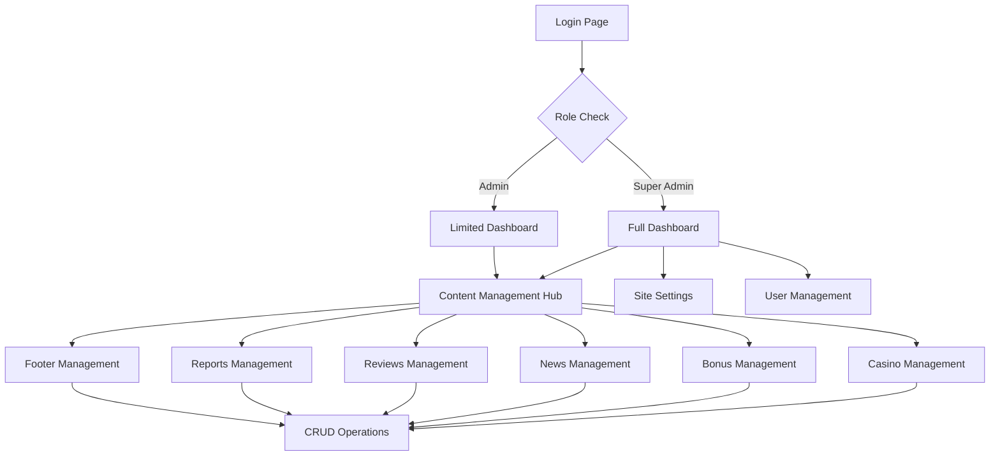

# Admin Panel Restructuring - Product Requirements Document

## 1. Product Overview

Restrukturisasi komprehensif panel admin existing menjadi sistem terpusat yang aman, terstruktur, dan siap produksi. Sistem baru akan memisahkan dashboard analitik dari fungsi CRUD, dengan navigasi terpusat untuk setiap halaman publik.

* **Tujuan Utama**: Menciptakan admin panel yang lebih terorganisir dengan keamanan enterprise-level

* **Target Pengguna**: Super Admin dan Admin dengan role-based access control

* **Nilai Bisnis**: Meningkatkan efisiensi pengelolaan konten dan keamanan sistem secara keseluruhan

## 2. Core Features

### 2.1 User Roles

| Role        | Registration Method        | Core Permissions                                                   |
| ----------- | -------------------------- | ------------------------------------------------------------------ |
| Super Admin | Direct database assignment | Full access to all CRUD operations, analytics, and system settings |
| Admin       | Invitation by Super Admin  | Limited CRUD access, view analytics, no system settings            |

### 2.2 Feature Module

Sistem admin panel yang direstrukturisasi terdiri dari halaman-halaman utama berikut:

1. **Dashboard Analytics**: statistik pengguna, laporan performa, overview sistem
2. **Content Management Hub**: navigasi terpusat ke semua halaman CRUD
3. **Casino Management**: CRUD lengkap untuk data kasino
4. **Bonus Management**: CRUD lengkap untuk data bonus
5. **News Management**: CRUD lengkap untuk artikel berita
6. **Reviews Management**: CRUD lengkap untuk ulasan kasino
7. **Reports Management**: CRUD lengkap untuk laporan
8. **Footer Management**: CRUD lengkap untuk konten footer
9. **Site Settings**: konfigurasi global website
10. **User Management**: pengelolaan admin dan role assignment

### 2.3 Page Details

| Page Name              | Module Name            | Feature Description                                                          |
| ---------------------- | ---------------------- | ---------------------------------------------------------------------------- |
| Dashboard Analytics    | Statistics Overview    | Display user count, review statistics, recent reports with real-time updates |
| Dashboard Analytics    | Performance Metrics    | Show page views, conversion rates, system health monitoring                  |
| Content Management Hub | Navigation Center      | Centralized links to all CRUD pages with quick access buttons                |
| Content Management Hub | Recent Activities      | Display latest content changes across all modules                            |
| Casino Management      | CRUD Operations        | Create, read, update, delete casino entries with image upload                |
| Casino Management      | Bulk Operations        | Import/export casino data, bulk status updates                               |
| Bonus Management       | CRUD Operations        | Manage bonus offers with casino associations and validation                  |
| Bonus Management       | Approval Workflow      | Review and approve bonus submissions with status tracking                    |
| News Management        | CRUD Operations        | Create and manage news articles with rich text editor                        |
| News Management        | Publication Control    | Schedule publishing, draft management, SEO optimization                      |
| Reviews Management     | CRUD Operations        | Moderate and manage casino reviews with rating systems                       |
| Reviews Management     | Moderation Tools       | Flag inappropriate content, user feedback management                         |
| Reports Management     | CRUD Operations        | Handle user reports with categorization and resolution tracking              |
| Reports Management     | Analytics Integration  | Generate insights from report patterns and trends                            |
| Footer Management      | CRUD Operations        | Manage footer links, legal pages, and contact information                    |
| Footer Management      | Multi-language Support | Handle footer content in multiple languages                                  |
| Site Settings          | Global Configuration   | Manage site-wide settings, API keys, and system preferences                  |
| Site Settings          | Security Settings      | Configure authentication, rate limiting, and access controls                 |
| User Management        | Admin CRUD             | Create, manage admin accounts with role assignments                          |
| User Management        | Permission Matrix      | Fine-grained permission control for different admin levels                   |

## 3. Core Process

### Super Admin Flow

1. Login dengan autentikasi multi-faktor
2. Akses dashboard analytics untuk overview sistem
3. Navigasi ke Content Management Hub untuk akses terpusat
4. Pilih modul CRUD yang diinginkan (Casino, Bonus, News, dll)
5. Lakukan operasi CRUD dengan validasi keamanan
6. Monitor aktivitas melalui audit logs
7. Kelola user dan permissions melalui User Management

### Admin Flow

1. Login dengan kredensial yang diberikan Super Admin
2. Akses dashboard analytics (view-only)
3. Navigasi ke modul CRUD sesuai permission yang diberikan
4. Lakukan operasi CRUD dalam batasan role
5. Submit perubahan untuk approval (jika diperlukan)

## 4. User Interface Design

### 4.1 Design Style

* **Primary Colors**: #1e40af (blue-800), #3b82f6 (blue-500)

* **Secondary Colors**: #64748b (slate-500), #f8fafc (slate-50)

* **Button Style**: Rounded corners (8px), subtle shadows, hover animations

* **Font**: Inter font family, 14px base size, 16px for headings

* **Layout Style**: Card-based design dengan sidebar navigation, clean minimalist approach

* **Icons**: Lucide React icons dengan consistent sizing (20px untuk navigation, 16px untuk actions)

### 4.2 Page Design Overview

| Page Name              | Module Name      | UI Elements                                                                                   |
| ---------------------- | ---------------- | --------------------------------------------------------------------------------------------- |
| Dashboard Analytics    | Statistics Cards | Glass-morphism cards dengan gradient backgrounds, real-time counters, chart visualizations    |
| Content Management Hub | Navigation Grid  | 3x3 grid layout dengan icon-based navigation cards, hover effects, quick action buttons       |
| CRUD Pages             | Data Tables      | Sortable tables dengan pagination, search filters, bulk action checkboxes                     |
| CRUD Pages             | Form Modals      | Slide-in modals dengan form validation, file upload areas, rich text editors                  |
| Sidebar Navigation     | Menu Structure   | Collapsible sidebar dengan grouped menu items, active state indicators, role-based visibility |

### 4.3 Responsiveness

Desktop-first design dengan mobile adaptation:

* Sidebar collapses to hamburger menu pada tablet/mobile

* Tables menjadi card layout pada screen kecil

* Touch-optimized buttons dan form elements

* Responsive grid layouts dengan breakpoints: sm (640px), md (768px), lg (1024px), xl (1280px)

## 5. Security Requirements

### 5.1 Authentication & Authorization

* Multi-factor authentication untuk Super Admin

* Role-based access control (RBAC) dengan granular permissions

* Session management dengan automatic timeout

* Password policies dengan complexity requirements

### 5.2 Data Protection

* Input validation dan sanitization pada semua form

* SQL injection prevention melalui parameterized queries

* XSS protection dengan content security policies

* File upload validation dengan type dan size restrictions

### 5.3 API Security

* Rate limiting untuk mencegah abuse

* CORS configuration yang proper

* API key management untuk external integrations

* Request/response logging untuk audit trails

## 6. Technical Specifications

### 6.1 Technology Stack

* **Frontend**: React 18 + TypeScript + Tailwind CSS

* **Backend**: Next.js API Routes + Supabase

* **Database**: PostgreSQL (via Supabase)

* **Authentication**: Supabase Auth dengan custom policies

* **File Storage**: Supabase Storage dengan CDN

### 6.2 Performance Requirements

* Page load time < 2 seconds

* API response time < 500ms

* Real-time updates dengan WebSocket connections

* Optimistic UI updates untuk better user experience

### 6.3 Monitoring & Analytics

* Error tracking dengan detailed logging

* Performance monitoring untuk database queries

* User activity tracking untuk audit purposes

* System health monitoring dengan alerts

## 7. Migration Strategy

### 7.1 Data Preservation

* Automated backup sebelum migration

* Incremental data migration untuk minimize downtime

* Rollback procedures jika terjadi issues

* Data integrity validation post-migration

### 7.2 Deployment Phases

1. **Phase 1**: Database schema updates dan RLS policies
2. **Phase 2**: New dashboard implementation dengan analytics
3. **Phase 3**: Centralized CRUD interfaces
4. **Phase 4**: Security hardening dan testing
5. **Phase 5**: Production deployment dengan monitoring

### 7.3 Testing Strategy

* Unit testing untuk semua components

* Integration testing untuk API endpoints

* Security testing untuk vulnerability assessment

* User acceptance testing dengan stakeholders

## 8. Success Metrics

* **Security**: Zero security incidents dalam 6 bulan pertama

* **Performance**: 99.9% uptime dengan response time < 500ms

* **Usability**: Admin task completion time berkurang 40%

* **Maintainability**: Code coverage > 80%, zero critical bugs

## 9. Risk Mitigation

* **Data Loss Risk**: Automated backups dan tested restore procedures

* **Security Risk**: Regular security audits dan penetration testing

* **Performance Risk**: Load testing dan capacity planning

* **User Adoption Risk**: Comprehensive training dan documentation

