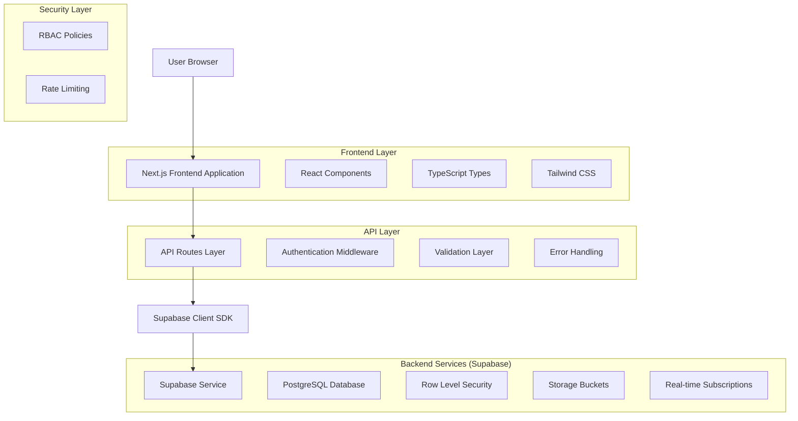
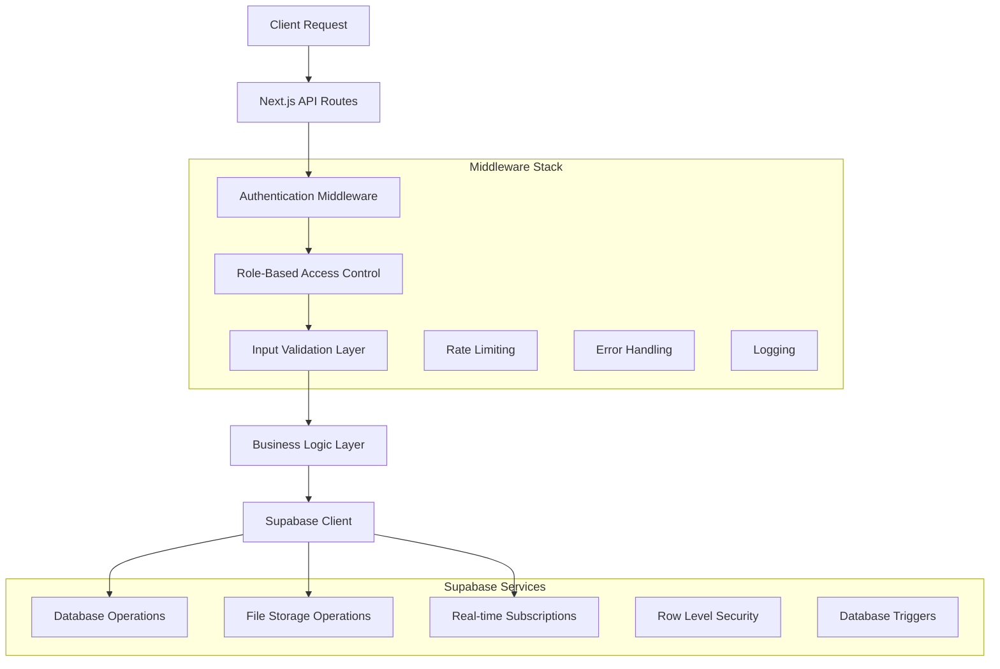
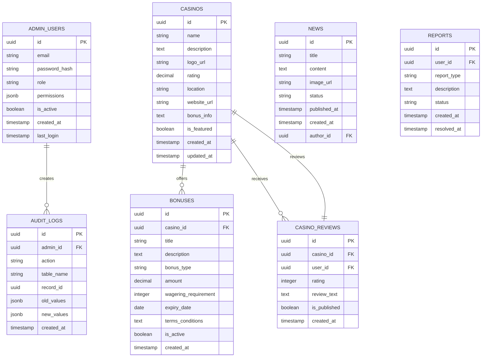

# Admin Panel Restructuring - Technical Architecture Document

## 1. Architecture Design



## 2. Technology Description

- **Frontend**: React@18 + TypeScript@5 + Tailwind CSS@3 + Next.js@14
- **Backend**: Next.js API Routes + Supabase SDK
- **Database**: Supabase (PostgreSQL) dengan Row Level Security
- **Authentication**: Supabase Auth dengan custom policies
- **File Storage**: Supabase Storage dengan CDN
- **Real-time**: Supabase Realtime untuk live updates
- **Validation**: Zod untuk schema validation
- **Forms**: React Hook Form untuk form management
- **State Management**: React Query untuk server state

## 3. Route Definitions

| Route | Purpose |
|-------|----------|
| /admin | Main dashboard dengan analytics dan overview |
| /admin/content | Content Management Hub dengan navigasi terpusat |
| /admin/casinos | CRUD interface untuk manajemen kasino |
| /admin/bonuses | CRUD interface untuk manajemen bonus |
| /admin/news | CRUD interface untuk manajemen berita |
| /admin/reviews | CRUD interface untuk manajemen ulasan |
| /admin/reports | CRUD interface untuk manajemen laporan |
| /admin/footer | CRUD interface untuk manajemen footer |
| /admin/settings | Konfigurasi global dan pengaturan sistem |
| /admin/users | Manajemen admin users dan permissions |
| /admin/audit | Audit logs dan activity tracking |

## 4. API Definitions

### 4.1 Authentication APIs

**Admin Login**
```
POST /api/admin/auth/login
```

Request:
| Param Name | Param Type | isRequired | Description |
|------------|------------|------------|-------------|
| email | string | true | Admin email address |
| password | string | true | Admin password |
| mfa_code | string | false | Multi-factor authentication code |

Response:
| Param Name | Param Type | Description |
|------------|------------|-------------|
| success | boolean | Authentication status |
| user | object | Admin user data with role |
| session | object | Session token and expiry |

**Role Verification**
```
GET /api/admin/auth/verify
```

Response:
| Param Name | Param Type | Description |
|------------|------------|-------------|
| role | string | User role (super_admin, admin) |
| permissions | array | List of allowed permissions |
| valid | boolean | Session validity status |

### 4.2 Content Management APIs

**Get All Content Types**
```
GET /api/admin/content
```

Response:
| Param Name | Param Type | Description |
|------------|------------|-------------|
| content_types | array | Available content management modules |
| statistics | object | Count statistics for each type |

**Casino Management**
```
GET /api/admin/casinos
POST /api/admin/casinos
PUT /api/admin/casinos/[id]
DELETE /api/admin/casinos/[id]
```

Casino Object:
| Param Name | Param Type | Description |
|------------|------------|-------------|
| id | uuid | Unique casino identifier |
| name | string | Casino name |
| description | text | Casino description |
| logo_url | string | Logo image URL |
| rating | decimal | Casino rating (1-5) |
| location | string | Casino location |
| website_url | string | Official website URL |
| bonus_info | text | Bonus information |
| is_featured | boolean | Featured status |
| created_at | timestamp | Creation timestamp |
| updated_at | timestamp | Last update timestamp |

**Bonus Management**
```
GET /api/admin/bonuses
POST /api/admin/bonuses
PUT /api/admin/bonuses/[id]
DELETE /api/admin/bonuses/[id]
```

Bonus Object:
| Param Name | Param Type | Description |
|------------|------------|-------------|
| id | uuid | Unique bonus identifier |
| casino_id | uuid | Associated casino ID |
| title | string | Bonus title |
| description | text | Bonus description |
| bonus_type | string | Type of bonus (welcome, deposit, etc) |
| amount | decimal | Bonus amount |
| wagering_requirement | integer | Wagering requirement multiplier |
| expiry_date | date | Bonus expiry date |
| terms_conditions | text | Terms and conditions |
| is_active | boolean | Active status |

### 4.3 Analytics APIs

**Dashboard Statistics**
```
GET /api/admin/analytics/dashboard
```

Response:
| Param Name | Param Type | Description |
|------------|------------|-------------|
| total_users | integer | Total registered users |
| total_reviews | integer | Total casino reviews |
| pending_reports | integer | Pending reports count |
| monthly_growth | object | Monthly growth statistics |
| top_casinos | array | Top rated casinos |
| recent_activities | array | Recent admin activities |

### 4.4 File Upload APIs

**Upload Image**
```
POST /api/admin/upload
```

Request (multipart/form-data):
| Param Name | Param Type | isRequired | Description |
|------------|------------|------------|-------------|
| file | file | true | Image file (jpg, png, webp) |
| type | string | true | Upload type (logo, banner, etc) |
| entity_id | uuid | false | Associated entity ID |

Response:
| Param Name | Param Type | Description |
|------------|------------|-------------|
| url | string | Uploaded file URL |
| filename | string | Generated filename |
| size | integer | File size in bytes |

## 5. Server Architecture Diagram



## 6. Data Model

### 6.1 Data Model Definition



### 6.2 Data Definition Language

**Admin Users Table**
```sql
-- Create admin users table
CREATE TABLE admin_users (
    id UUID PRIMARY KEY DEFAULT gen_random_uuid(),
    email VARCHAR(255) UNIQUE NOT NULL,
    password_hash VARCHAR(255) NOT NULL,
    role VARCHAR(50) NOT NULL CHECK (role IN ('super_admin', 'admin')),
    permissions JSONB DEFAULT '{}',
    is_active BOOLEAN DEFAULT true,
    created_at TIMESTAMP WITH TIME ZONE DEFAULT NOW(),
    last_login TIMESTAMP WITH TIME ZONE,
    updated_at TIMESTAMP WITH TIME ZONE DEFAULT NOW()
);

-- Create indexes
CREATE INDEX idx_admin_users_email ON admin_users(email);
CREATE INDEX idx_admin_users_role ON admin_users(role);
CREATE INDEX idx_admin_users_active ON admin_users(is_active);

-- Enable RLS
ALTER TABLE admin_users ENABLE ROW LEVEL SECURITY;

-- RLS Policies
CREATE POLICY "Super admins can manage all admin users" ON admin_users
    FOR ALL USING (auth.jwt() ->> 'role' = 'super_admin');

CREATE POLICY "Admins can view their own profile" ON admin_users
    FOR SELECT USING (auth.uid() = id);
```

**Enhanced Casinos Table**
```sql
-- Update existing casinos table
ALTER TABLE casinos ADD COLUMN IF NOT EXISTS is_featured BOOLEAN DEFAULT false;
ALTER TABLE casinos ADD COLUMN IF NOT EXISTS seo_title VARCHAR(255);
ALTER TABLE casinos ADD COLUMN IF NOT EXISTS seo_description TEXT;
ALTER TABLE casinos ADD COLUMN IF NOT EXISTS status VARCHAR(50) DEFAULT 'active';

-- Create indexes
CREATE INDEX idx_casinos_featured ON casinos(is_featured);
CREATE INDEX idx_casinos_status ON casinos(status);
CREATE INDEX idx_casinos_rating ON casinos(rating DESC);

-- Update RLS policies
CREATE POLICY "Authenticated admins can manage casinos" ON casinos
    FOR ALL USING (auth.jwt() ->> 'role' IN ('super_admin', 'admin'));
```

**Audit Logs Table**
```sql
-- Create audit logs table
CREATE TABLE audit_logs (
    id UUID PRIMARY KEY DEFAULT gen_random_uuid(),
    admin_id UUID REFERENCES admin_users(id),
    action VARCHAR(50) NOT NULL,
    table_name VARCHAR(100) NOT NULL,
    record_id UUID,
    old_values JSONB,
    new_values JSONB,
    ip_address INET,
    user_agent TEXT,
    created_at TIMESTAMP WITH TIME ZONE DEFAULT NOW()
);

-- Create indexes
CREATE INDEX idx_audit_logs_admin_id ON audit_logs(admin_id);
CREATE INDEX idx_audit_logs_table_name ON audit_logs(table_name);
CREATE INDEX idx_audit_logs_created_at ON audit_logs(created_at DESC);

-- Enable RLS
ALTER TABLE audit_logs ENABLE ROW LEVEL SECURITY;

-- RLS Policy
CREATE POLICY "Admins can view audit logs" ON audit_logs
    FOR SELECT USING (auth.jwt() ->> 'role' IN ('super_admin', 'admin'));
```

**Content Management Table**
```sql
-- Create content management table for centralized content
CREATE TABLE content_sections (
    id UUID PRIMARY KEY DEFAULT gen_random_uuid(),
    page_name VARCHAR(100) NOT NULL,
    section_type VARCHAR(50) NOT NULL,
    title VARCHAR(255),
    content TEXT,
    metadata JSONB DEFAULT '{}',
    display_order INTEGER DEFAULT 0,
    is_active BOOLEAN DEFAULT true,
    created_at TIMESTAMP WITH TIME ZONE DEFAULT NOW(),
    updated_at TIMESTAMP WITH TIME ZONE DEFAULT NOW()
);

-- Create indexes
CREATE INDEX idx_content_sections_page ON content_sections(page_name);
CREATE INDEX idx_content_sections_type ON content_sections(section_type);
CREATE INDEX idx_content_sections_active ON content_sections(is_active);
CREATE INDEX idx_content_sections_order ON content_sections(display_order);

-- Enable RLS
ALTER TABLE content_sections ENABLE ROW LEVEL SECURITY;

-- RLS Policies
CREATE POLICY "Public can view active content" ON content_sections
    FOR SELECT USING (is_active = true);

CREATE POLICY "Admins can manage content" ON content_sections
    FOR ALL USING (auth.jwt() ->> 'role' IN ('super_admin', 'admin'));
```

**Database Functions and Triggers**
```sql
-- Function to update updated_at timestamp
CREATE OR REPLACE FUNCTION update_updated_at_column()
RETURNS TRIGGER AS $$
BEGIN
    NEW.updated_at = NOW();
    RETURN NEW;
END;
$$ language 'plpgsql';

-- Apply trigger to relevant tables
CREATE TRIGGER update_casinos_updated_at BEFORE UPDATE ON casinos
    FOR EACH ROW EXECUTE FUNCTION update_updated_at_column();

CREATE TRIGGER update_content_sections_updated_at BEFORE UPDATE ON content_sections
    FOR EACH ROW EXECUTE FUNCTION update_updated_at_column();

-- Function for audit logging
CREATE OR REPLACE FUNCTION audit_trigger_function()
RETURNS TRIGGER AS $$
BEGIN
    IF TG_OP = 'DELETE' THEN
        INSERT INTO audit_logs (admin_id, action, table_name, record_id, old_values)
        VALUES (
            (auth.jwt() ->> 'sub')::uuid,
            TG_OP,
            TG_TABLE_NAME,
            OLD.id,
            to_jsonb(OLD)
        );
        RETURN OLD;
    ELSIF TG_OP = 'UPDATE' THEN
        INSERT INTO audit_logs (admin_id, action, table_name, record_id, old_values, new_values)
        VALUES (
            (auth.jwt() ->> 'sub')::uuid,
            TG_OP,
            TG_TABLE_NAME,
            NEW.id,
            to_jsonb(OLD),
            to_jsonb(NEW)
        );
        RETURN NEW;
    ELSIF TG_OP = 'INSERT' THEN
        INSERT INTO audit_logs (admin_id, action, table_name, record_id, new_values)
        VALUES (
            (auth.jwt() ->> 'sub')::uuid,
            TG_OP,
            TG_TABLE_NAME,
            NEW.id,
            to_jsonb(NEW)
        );
        RETURN NEW;
    END IF;
    RETURN NULL;
END;
$$ LANGUAGE plpgsql;

-- Apply audit triggers to important tables
CREATE TRIGGER audit_casinos_trigger
    AFTER INSERT OR UPDATE OR DELETE ON casinos
    FOR EACH ROW EXECUTE FUNCTION audit_trigger_function();

CREATE TRIGGER audit_bonuses_trigger
    AFTER INSERT OR UPDATE OR DELETE ON bonuses
    FOR EACH ROW EXECUTE FUNCTION audit_trigger_function();
```

## 7. Security Implementation

### 7.1 Authentication Flow
1. Admin login dengan email/password
2. MFA verification untuk Super Admin
3. JWT token generation dengan role claims
4. Session management dengan refresh tokens
5. Automatic logout pada inactivity

### 7.2 Authorization Matrix

| Permission | Super Admin | Admin |
|------------|-------------|-------|
| View Dashboard | ✅ | ✅ |
| Manage Casinos | ✅ | ✅ |
| Manage Bonuses | ✅ | ✅ |
| Manage News | ✅ | ✅ |
| Manage Reviews | ✅ | ✅ |
| Manage Reports | ✅ | ✅ |
| Manage Footer | ✅ | ❌ |
| Site Settings | ✅ | ❌ |
| User Management | ✅ | ❌ |
| Audit Logs | ✅ | ❌ |

### 7.3 Rate Limiting Configuration
```javascript
// Rate limiting rules
const rateLimits = {
  login: { requests: 5, window: '15m' },
  api: { requests: 100, window: '1m' },
  upload: { requests: 10, window: '1m' },
  bulk_operations: { requests: 3, window: '5m' }
};
```

## 8. Performance Optimization

### 8.1 Caching Strategy
- Redis caching untuk frequently accessed data
- Browser caching untuk static assets
- Database query optimization dengan proper indexing
- Image optimization dengan WebP format

### 8.2 Real-time Updates
- Supabase Realtime untuk live data updates
- Optimistic UI updates untuk better UX
- WebSocket connections untuk admin notifications
- Event-driven architecture untuk system notifications

### 8.3 Monitoring Setup
- Application performance monitoring (APM)
- Database query performance tracking
- Error tracking dengan stack traces
- User activity analytics untuk admin usage patterns