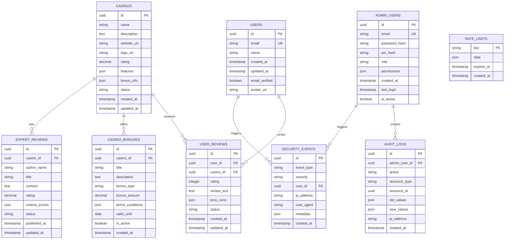

# Arsitektur Teknis - Security Enhanced
## Platform Casino Review dengan Standar Enterprise Security

---

## 1. Architecture Design


## 2. Technology Description

**Frontend Stack**:
- React@18 + Next.js@14 (App Router)
- TypeScript@5 (Strict mode enabled)
- Tailwind CSS@3 + Radix UI components
- React Query@4 untuk state management
- Framer Motion untuk animations

**Security & Infrastructure**:
- Redis untuk persistent rate limiting
- Supabase untuk authentication & database
- Sentry untuk error monitoring & alerting
- Vercel untuk hosting & edge functions

**Development & Quality**:
- ESLint + Prettier untuk code quality
- Jest + React Testing Library untuk testing
- Husky untuk pre-commit hooks
- GitHub Actions untuk CI/CD

## 3. Route Definitions

| Route | Purpose | Security Level |
|-------|---------|----------------|
| / | Homepage dengan featured casinos | Public |
| /casinos | Daftar semua casino | Public |
| /casinos/[id] | Detail casino individual | Public |
| /casinos/[id]/review | Form review casino | Authenticated |
| /bonuses | Daftar bonus casino | Public |
| /news | Artikel berita casino | Public |
| /news/[id] | Detail artikel berita | Public |
| /expert-reviews | Review expert | Public |
| /expert-reviews/[slug] | Detail review expert | Public |
| /reports | Laporan casino | Public |
| /auth/login | Login pengguna | Public |
| /auth/register | Registrasi pengguna | Public |
| /profile | Profil pengguna | Authenticated |
| /admin/* | Panel administrasi | Admin Only |
| /admin/login | Login admin | Admin Auth |
| /admin/auth/admin-pin | Verifikasi PIN admin | Admin Auth |

## 4. API Definitions

### 4.1 Authentication APIs

**Admin Login**
```
POST /api/admin/auth/login
```

Request:
| Param Name | Param Type | isRequired | Description |
|------------|------------|------------|-------------|
| email | string | true | Admin email address |
| password | string | true | Admin password (hashed) |
| rememberMe | boolean | false | Extended session flag |

Response:
| Param Name | Param Type | Description |
|------------|------------|-------------|
| success | boolean | Login status |
| sessionToken | string | JWT session token |
| expiresAt | number | Token expiration timestamp |
| user | AdminUser | Admin user object |

Example:
```json
{
  "success": true,
  "sessionToken": "eyJhbGciOiJIUzI1NiIsInR5cCI6IkpXVCJ9...",
  "expiresAt": 1703980800000,
  "user": {
    "id": "admin-123",
    "email": "admin@example.com",
    "role": "admin",
    "permissions": ["casino.read", "casino.write"]
  }
}
```

**PIN Verification**
```
POST /api/admin/pin-verify
```

Request:
| Param Name | Param Type | isRequired | Description |
|------------|------------|------------|-------------|
| pin | string | true | 6-digit PIN code |
| sessionToken | string | true | Valid admin session token |

Response:
| Param Name | Param Type | Description |
|------------|------------|-------------|
| success | boolean | Verification status |
| pinToken | string | PIN verification token |
| expiresAt | number | PIN token expiration |

### 4.2 Security APIs

**CSRF Token Generation**
```
GET /api/admin/csrf-token
```

Response:
| Param Name | Param Type | Description |
|------------|------------|-------------|
| token | string | CSRF protection token |
| expiresAt | number | Token expiration timestamp |

**Rate Limit Status**
```
GET /api/security/rate-limit-status
```

Response:
| Param Name | Param Type | Description |
|------------|------------|-------------|
| remaining | number | Remaining requests |
| resetTime | number | Reset timestamp |
| limit | number | Total request limit |

### 4.3 Casino Management APIs

**Get Casinos**
```
GET /api/admin/casinos
```

Query Parameters:
| Param Name | Param Type | isRequired | Description |
|------------|------------|------------|-------------|
| page | number | false | Page number (default: 1) |
| limit | number | false | Items per page (default: 20) |
| search | string | false | Search query |
| status | string | false | Filter by status |

**Create Casino**
```
POST /api/admin/casinos
```

Request:
| Param Name | Param Type | isRequired | Description |
|------------|------------|------------|-------------|
| name | string | true | Casino name |
| description | string | true | Casino description |
| website_url | string | true | Official website URL |
| logo_url | string | false | Logo image URL |
| rating | number | false | Casino rating (1-5) |
| features | string[] | false | Casino features array |
| bonus_info | object | false | Bonus information |

## 5. Server Architecture Diagram


## 6. Data Model

### 6.1 Data Model Definition



### 6.2 Data Definition Language

**Users Table**
```sql
-- Create users table
CREATE TABLE users (
    id UUID PRIMARY KEY DEFAULT gen_random_uuid(),
    email VARCHAR(255) UNIQUE NOT NULL,
    name VARCHAR(100) NOT NULL,
    created_at TIMESTAMP WITH TIME ZONE DEFAULT NOW(),
    updated_at TIMESTAMP WITH TIME ZONE DEFAULT NOW(),
    email_verified BOOLEAN DEFAULT FALSE,
    avatar_url TEXT
);

-- Create indexes
CREATE INDEX idx_users_email ON users(email);
CREATE INDEX idx_users_created_at ON users(created_at DESC);
```

**Admin Users Table**
```sql
-- Create admin_users table
CREATE TABLE admin_users (
    id UUID PRIMARY KEY DEFAULT gen_random_uuid(),
    email VARCHAR(255) UNIQUE NOT NULL,
    password_hash VARCHAR(255) NOT NULL,
    pin_hash VARCHAR(255) NOT NULL,
    role VARCHAR(50) DEFAULT 'admin' CHECK (role IN ('admin', 'super_admin')),
    permissions JSONB DEFAULT '[]'::jsonb,
    created_at TIMESTAMP WITH TIME ZONE DEFAULT NOW(),
    last_login TIMESTAMP WITH TIME ZONE,
    is_active BOOLEAN DEFAULT TRUE
);

-- Create indexes
CREATE INDEX idx_admin_users_email ON admin_users(email);
CREATE INDEX idx_admin_users_role ON admin_users(role);
CREATE INDEX idx_admin_users_is_active ON admin_users(is_active);

-- Insert default admin user
INSERT INTO admin_users (email, password_hash, pin_hash, role, permissions)
VALUES (
    'admin@example.com',
    '$2b$12$example_hashed_password',
    '$2b$12$example_hashed_pin',
    'super_admin',
    '["casino.read", "casino.write", "casino.delete", "user.read", "user.write", "content.read", "content.write", "audit.read"]'::jsonb
);
```

**Casinos Table**
```sql
-- Create casinos table
CREATE TABLE casinos (
    id UUID PRIMARY KEY DEFAULT gen_random_uuid(),
    name VARCHAR(255) NOT NULL,
    description TEXT,
    website_url VARCHAR(500) NOT NULL,
    logo_url VARCHAR(500),
    rating DECIMAL(2,1) CHECK (rating >= 1.0 AND rating <= 5.0),
    features JSONB DEFAULT '[]'::jsonb,
    bonus_info JSONB DEFAULT '{}'::jsonb,
    status VARCHAR(20) DEFAULT 'active' CHECK (status IN ('active', 'inactive', 'pending')),
    created_at TIMESTAMP WITH TIME ZONE DEFAULT NOW(),
    updated_at TIMESTAMP WITH TIME ZONE DEFAULT NOW()
);

-- Create indexes
CREATE INDEX idx_casinos_name ON casinos(name);
CREATE INDEX idx_casinos_rating ON casinos(rating DESC);
CREATE INDEX idx_casinos_status ON casinos(status);
CREATE INDEX idx_casinos_created_at ON casinos(created_at DESC);

-- Full-text search index
CREATE INDEX idx_casinos_search ON casinos USING gin(to_tsvector('english', name || ' ' || COALESCE(description, '')));
```

**Security Events Table**
```sql
-- Create security_events table
CREATE TABLE security_events (
    id UUID PRIMARY KEY DEFAULT gen_random_uuid(),
    event_type VARCHAR(100) NOT NULL,
    severity VARCHAR(20) DEFAULT 'medium' CHECK (severity IN ('low', 'medium', 'high', 'critical')),
    user_id UUID REFERENCES users(id),
    ip_address INET,
    user_agent TEXT,
    metadata JSONB DEFAULT '{}'::jsonb,
    created_at TIMESTAMP WITH TIME ZONE DEFAULT NOW()
);

-- Create indexes
CREATE INDEX idx_security_events_type ON security_events(event_type);
CREATE INDEX idx_security_events_severity ON security_events(severity);
CREATE INDEX idx_security_events_user_id ON security_events(user_id);
CREATE INDEX idx_security_events_ip ON security_events(ip_address);
CREATE INDEX idx_security_events_created_at ON security_events(created_at DESC);

-- Partition by month for performance
CREATE TABLE security_events_y2024m01 PARTITION OF security_events
FOR VALUES FROM ('2024-01-01') TO ('2024-02-01');
```

**Rate Limits Table**
```sql
-- Create rate_limits table (untuk fallback jika Redis tidak tersedia)
CREATE TABLE rate_limits (
    key VARCHAR(255) PRIMARY KEY,
    data JSONB NOT NULL,
    expires_at TIMESTAMP WITH TIME ZONE NOT NULL,
    created_at TIMESTAMP WITH TIME ZONE DEFAULT NOW()
);

-- Create indexes
CREATE INDEX idx_rate_limits_expires_at ON rate_limits(expires_at);

-- Auto-cleanup expired entries
CREATE OR REPLACE FUNCTION cleanup_expired_rate_limits()
RETURNS void AS $$
BEGIN
    DELETE FROM rate_limits WHERE expires_at < NOW();
END;
$$ LANGUAGE plpgsql;

-- Schedule cleanup every hour
SELECT cron.schedule('cleanup-rate-limits', '0 * * * *', 'SELECT cleanup_expired_rate_limits();');
```

**Audit Logs Table**
```sql
-- Create audit_logs table
CREATE TABLE audit_logs (
    id UUID PRIMARY KEY DEFAULT gen_random_uuid(),
    admin_user_id UUID REFERENCES admin_users(id),
    action VARCHAR(100) NOT NULL,
    resource_type VARCHAR(50) NOT NULL,
    resource_id UUID,
    old_values JSONB,
    new_values JSONB,
    ip_address INET,
    created_at TIMESTAMP WITH TIME ZONE DEFAULT NOW()
);

-- Create indexes
CREATE INDEX idx_audit_logs_admin_user_id ON audit_logs(admin_user_id);
CREATE INDEX idx_audit_logs_action ON audit_logs(action);
CREATE INDEX idx_audit_logs_resource_type ON audit_logs(resource_type);
CREATE INDEX idx_audit_logs_created_at ON audit_logs(created_at DESC);

-- Partition by month
CREATE TABLE audit_logs_y2024m01 PARTITION OF audit_logs
FOR VALUES FROM ('2024-01-01') TO ('2024-02-01');
```

**Row Level Security (RLS) Policies**
```sql
-- Enable RLS
ALTER TABLE users ENABLE ROW LEVEL SECURITY;
ALTER TABLE casinos ENABLE ROW LEVEL SECURITY;
ALTER TABLE user_reviews ENABLE ROW LEVEL SECURITY;
ALTER TABLE security_events ENABLE ROW LEVEL SECURITY;

-- Users can only see their own data
CREATE POLICY "Users can view own profile" ON users
    FOR SELECT USING (auth.uid() = id);

CREATE POLICY "Users can update own profile" ON users
    FOR UPDATE USING (auth.uid() = id);

-- Public read access for casinos
CREATE POLICY "Anyone can view active casinos" ON casinos
    FOR SELECT USING (status = 'active');

-- Admin full access
CREATE POLICY "Admins have full access" ON casinos
    FOR ALL USING (
        EXISTS (
            SELECT 1 FROM admin_users 
            WHERE id = auth.uid() AND is_active = true
        )
    );

-- Users can only see their own reviews
CREATE POLICY "Users can view own reviews" ON user_reviews
    FOR SELECT USING (auth.uid() = user_id);

CREATE POLICY "Users can create reviews" ON user_reviews
    FOR INSERT WITH CHECK (auth.uid() = user_id);

-- Security events - admin only
CREATE POLICY "Admins can view security events" ON security_events
    FOR SELECT USING (
        EXISTS (
            SELECT 1 FROM admin_users 
            WHERE id = auth.uid() AND is_active = true
        )
    );
```

**Database Functions & Triggers**
```sql
-- Auto-update updated_at timestamp
CREATE OR REPLACE FUNCTION update_updated_at_column()
RETURNS TRIGGER AS $$
BEGIN
    NEW.updated_at = NOW();
    RETURN NEW;
END;
$$ LANGUAGE plpgsql;

-- Apply to relevant tables
CREATE TRIGGER update_users_updated_at BEFORE UPDATE ON users
    FOR EACH ROW EXECUTE FUNCTION update_updated_at_column();

CREATE TRIGGER update_casinos_updated_at BEFORE UPDATE ON casinos
    FOR EACH ROW EXECUTE FUNCTION update_updated_at_column();

CREATE TRIGGER update_user_reviews_updated_at BEFORE UPDATE ON user_reviews
    FOR EACH ROW EXECUTE FUNCTION update_updated_at_column();

-- Audit trigger for admin actions
CREATE OR REPLACE FUNCTION log_admin_action()
RETURNS TRIGGER AS $$
BEGIN
    INSERT INTO audit_logs (
        admin_user_id,
        action,
        resource_type,
        resource_id,
        old_values,
        new_values,
        ip_address
    ) VALUES (
        auth.uid(),
        TG_OP,
        TG_TABLE_NAME,
        COALESCE(NEW.id, OLD.id),
        CASE WHEN TG_OP = 'DELETE' THEN to_jsonb(OLD) ELSE NULL END,
        CASE WHEN TG_OP = 'INSERT' OR TG_OP = 'UPDATE' THEN to_jsonb(NEW) ELSE NULL END,
        inet_client_addr()
    );
    
    RETURN COALESCE(NEW, OLD);
END;
$$ LANGUAGE plpgsql;

-- Apply audit trigger to sensitive tables
CREATE TRIGGER audit_casinos AFTER INSERT OR UPDATE OR DELETE ON casinos
    FOR EACH ROW EXECUTE FUNCTION log_admin_action();

CREATE TRIGGER audit_admin_users AFTER INSERT OR UPDATE OR DELETE ON admin_users
    FOR EACH ROW EXECUTE FUNCTION log_admin_action();
```

## 7. Security Configuration

### 7.1 Environment Variables Schema

```typescript
// lib/config/env.schema.ts
import { z } from 'zod'

export const envSchema = z.object({
  // Node Environment
  NODE_ENV: z.enum(['development', 'staging', 'production']),
  
  // Security
  JWT_SECRET: z.string().min(32, 'JWT secret must be at least 32 characters'),
  CSRF_SECRET: z.string().min(32, 'CSRF secret must be at least 32 characters'),
  ADMIN_PIN: z.string().regex(/^\d{6}$/, 'Admin PIN must be 6 digits'),
  
  // Supabase
  NEXT_PUBLIC_SUPABASE_URL: z.string().url('Invalid Supabase URL'),
  NEXT_PUBLIC_SUPABASE_ANON_KEY: z.string().min(1, 'Supabase anon key required'),
  SUPABASE_SERVICE_ROLE_KEY: z.string().min(1, 'Supabase service role key required'),
  
  // Domain Configuration
  NEXT_PUBLIC_SITE_DOMAIN: z.string().min(1, 'Site domain required'),
  NEXT_PUBLIC_ADMIN_SUBDOMAIN: z.string().min(1, 'Admin subdomain required'),
  
  // Optional but recommended
  WEBHOOK_SECRET: z.string().min(32).optional(),
  REDIS_URL: z.string().url().optional(),
  ADMIN_IP_WHITELIST: z.string().optional(),
  
  // Rate Limiting
  DISABLE_PIN_RATE_LIMIT: z.enum(['0', '1']).default('0'),
  
  // Monitoring
  SENTRY_DSN: z.string().url().optional(),
  SENTRY_AUTH_TOKEN: z.string().optional(),
  SENTRY_ORG: z.string().optional(),
  SENTRY_PROJECT: z.string().optional(),
  
  // Analytics
  NEXT_PUBLIC_GA_ID: z.string().optional(),
})

export type Env = z.infer<typeof envSchema>

// Validate environment on startup
export function validateEnv(): Env {
  try {
    return envSchema.parse(process.env)
  } catch (error) {
    console.error('❌ Environment validation failed:')
    if (error instanceof z.ZodError) {
      error.errors.forEach(err => {
        console.error(`  - ${err.path.join('.')}: ${err.message}`)
      })
    }
    process.exit(1)
  }
}
```

### 7.2 Security Headers Configuration

```typescript
// lib/security/headers.ts
export const securityHeaders = {
  // Content Security Policy
  'Content-Security-Policy': [
    "default-src 'self'",
    "script-src 'self' 'nonce-{NONCE}' https://www.googletagmanager.com https://www.google-analytics.com",
    "style-src 'self' 'nonce-{NONCE}' https://fonts.googleapis.com",
    "img-src 'self' data: https: blob:",
    "font-src 'self' https://fonts.gstatic.com",
    "connect-src 'self' https://*.supabase.co https://www.google-analytics.com",
    "media-src 'self'",
    "object-src 'none'",
    "base-uri 'self'",
    "form-action 'self'",
    "frame-ancestors 'none'",
    "upgrade-insecure-requests"
  ].join('; '),
  
  // Security Headers
  'X-Frame-Options': 'DENY',
  'X-Content-Type-Options': 'nosniff',
  'X-XSS-Protection': '1; mode=block',
  'Referrer-Policy': 'strict-origin-when-cross-origin',
  'Permissions-Policy': [
    'camera=()',
    'microphone=()',
    'geolocation=()',
    'payment=()',
    'usb=()',
    'magnetometer=()',
    'accelerometer=()',
    'gyroscope=()'
  ].join(', '),
  
  // HSTS (only in production)
  ...(process.env.NODE_ENV === 'production' && {
    'Strict-Transport-Security': 'max-age=31536000; includeSubDomains; preload'
  })
}
```

### 7.3 Rate Limiting Configuration

```typescript
// lib/security/rate-limit-config.ts
export const rateLimitConfig = {
  // General API rate limiting
  api: {
    windowMs: 15 * 60 * 1000, // 15 minutes
    maxRequests: 100,
    skipSuccessfulRequests: false,
    skipFailedRequests: false
  },
  
  // Admin authentication
  adminAuth: {
    windowMs: 15 * 60 * 1000, // 15 minutes
    maxRequests: 5, // Very restrictive
    skipSuccessfulRequests: true,
    skipFailedRequests: false
  },
  
  // PIN verification
  pinVerification: {
    windowMs: 5 * 60 * 1000, // 5 minutes
    maxRequests: 3, // Very restrictive
    skipSuccessfulRequests: true,
    skipFailedRequests: false
  },
  
  // User registration/login
  userAuth: {
    windowMs: 15 * 60 * 1000, // 15 minutes
    maxRequests: 10,
    skipSuccessfulRequests: true,
    skipFailedRequests: false
  },
  
  // Content creation (reviews, etc.)
  contentCreation: {
    windowMs: 60 * 60 * 1000, // 1 hour
    maxRequests: 20,
    skipSuccessfulRequests: false,
    skipFailedRequests: true
  }
}
```

---

## 8. Deployment Architecture

### 8.1 Production Environment


### 8.2 Security Monitoring Stack

```typescript
// lib/monitoring/security-stack.ts
export const securityMonitoringStack = {
  // Error Tracking
  sentry: {
    dsn: process.env.SENTRY_DSN,
    environment: process.env.NODE_ENV,
    tracesSampleRate: 0.1,
    profilesSampleRate: 0.1,
    beforeSend: (event) => {
      // Filter sensitive data
      if (event.request?.headers) {
        delete event.request.headers['authorization']
        delete event.request.headers['cookie']
      }
      return event
    }
  },
  
  // Performance Monitoring
  webVitals: {
    enabled: true,
    reportAllChanges: false,
    thresholds: {
      CLS: 0.1,
      FID: 100,
      FCP: 1800,
      LCP: 2500,
      TTFB: 800
    }
  },
  
  // Security Event Logging
  securityEvents: {
    enabled: true,
    logLevel: 'info',
    alertThresholds: {
      failedLogins: 5,
      rateLimitViolations: 10,
      csrfViolations: 1
    }
  }
}
```

---

Dokumen arsitektur ini menyediakan blueprint teknis lengkap untuk implementasi security enhancements yang telah diidentifikasi dalam panduan implementasi. Semua komponen dirancang untuk bekerja secara terintegrasi dan mendukung standar keamanan enterprise-grade.